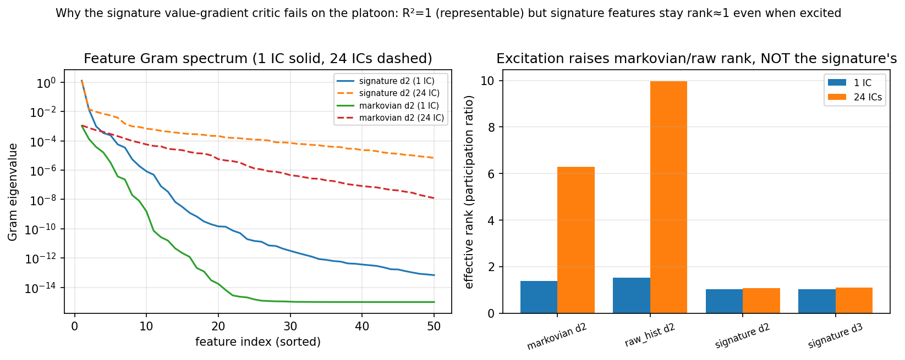

# Why the signature value-gradient critic fails on the high-dimensional platoon

**Question.** On the connected-cruise-control platoon
([`src/envs/platoon.py`](../../../src/envs/platoon.py); state dimension $2N=10$,
$N=5$ vehicles), the **markovian** value-gradient critic learns a good controller
($I=0.039$ vs the delayed-LQR optimum $0.028$ and no-control $0.075$), but the
**signature** critic does not: semi-gradient TD diverges, and LSTD — plain or
whitened — cannot recover a usable critic (best $I\approx3.5$, worse than no
control). Is the failure due to (1) the signature **features** (conditioning),
(2) **representation** capacity / non-Markovianity, or (3) the **control law**
(vertical derivative)?

**Method.** Data analysis of the signature features along trajectories
([`run/study/diagnose_signature_conditioning.py`](../../../run/study/diagnose_signature_conditioning.py)).
Roll the delayed-LQR oracle out from one initial condition and from 24 diverse
initial conditions; for each representation compute the features along the
trajectories and measure: the feature-Gram condition number and **effective rank**
(participation ratio $(\sum\lambda)^2/\sum\lambda^2$); the **value-fit $R^2$** of a
ridge least-squares critic on the discounted return-to-go (representation test); and
the closed-loop cost of the value-gradient control extracted from that ideal
least-squares critic (control test).

**Results** (regime $\alpha=3,\beta=1,\sigma=0.2$; string-stable, bounded paths).

| representation | dim | value-fit $R^2$ | eff. rank (1 IC) | eff. rank (24 ICs) | Gram cond |
|---|---|---|---|---|---|
| markovian deg-2 | 65 | 1.000 | 1.4 | **6.3** | $10^{9}$ |
| raw-history deg-2 | 4185 | 1.000 | 1.5 | **10.0** | $10^{13}$ |
| signature depth-2 | 462 | 1.000 | 1.0 | **1.1** | $10^{15}$ |
| signature depth-3 | 9723 | 1.000 | 1.0 | **1.1** | $10^{15}$ |

**Conclusion — it is a signature-specific feature-collinearity problem, not
representation.**

1. **Not representation / non-Markovianity.** The value-fit $R^2=1.0$ for *every*
   representation, signature included: a linear functional of the signature
   represents the value function essentially exactly. The signature *can* express the
   optimal value.

2. **Not (merely) data excitation.** With a single initial condition every
   representation is effective-rank $\approx1$. Exciting with 24 diverse initial
   conditions raises the markovian and raw-history effective rank to **6–10** (their
   linear critics become identifiable), but the **signature stays at effective rank
   $\approx1$** with condition number $\sim10^{15}$ regardless of excitation. The
   signature features are *intrinsically* near-collinear — dominated by a single
   direction (the monotone time-augmentation channel) on top of the algebraic
   **shuffle** redundancies of iterated integrals (e.g.
   $S^{(i,j)}+S^{(j,i)}=S^{(i)}S^{(j)}$). The linear-in-$\Phi$ critic is therefore
   **unidentifiable**, which is exactly why semi-gradient TD diverges (deadly triad on
   a rank-1 Gram) and LSTD — whose normal equations invert that same near-singular
   Gram — cannot recover a usable critic; per-feature whitening makes it worse because
   it amplifies the near-null directions.

3. **Caveat on the control test.** The ideal-critic (least-squares) value-gradient
   control costs are all worse than no-control, but that test is confounded: the
   least-squares critic is fit on the oracle's *narrow on-trajectory* state
   distribution, so its vertical derivative $\partial_x V$ is unreliable off that
   distribution (where the greedy control probes it). It does not bear on the
   conditioning finding.

**Implications / candidate fixes** (not yet validated):
- **Log-signature** — the minimal, non-redundant coordinates of the free Lie algebra;
  removes the shuffle redundancies and should raise the usable feature rank.
- **Per-channel signature normalisation / time-channel rescaling** so no single
  augmentation channel dominates the Gram spectrum.
- These are representation-level fixes; the env itself is sound (history genuinely
  matters here: the delayed-LQR optimum beats the markovian-LQR by $+105\%$), and the
  markovian critic already learns it, so the cell is a valid H1/H2 testbed *once the
  signature critic is made identifiable*.

Raw numbers and the figure regenerate via
`uv run python run/study/diagnose_signature_conditioning.py`
(outputs to `data/diagnose_signature_conditioning/`; the committed copy here is a
snapshot).

## Update (correction): conditioning is real but NOT the operative barrier

Implementing the prescribed fix — **centred features** in the LSTD critic (running
feature mean subtracted; the gauge fix) — and testing it on the platoon signature
**did not** make the agent learn: across regularisations the closed-loop cost stayed
$I\approx12$–$124$, far worse than no-control ($0.075$) and than the markovian critic
($0.039$). Centring **does** restore the feature-Gram effective rank ($1.07\to6.17$, as
the analysis predicted), so the conditioning diagnosis is correct *as far as it goes* —
but conditioning was **necessary, not sufficient**: it is not what blocks the control.

The binding barrier is the **value-gradient control law itself**, i.e. the **vertical
derivative** $\partial_x V=\theta^\top\partial_x\Phi$. Evidence: the *ideal* critic — a
least-squares fit with $R^2=1.0$ (perfect value on the data) — still yields bad control
($I=11$ for signature depth-2). A perfect value fit does not imply a usable gradient,
because $\partial_x V$ probes the critic **off** the (thin, low-dimensional) trajectory
manifold on which it was fit, where a high-dimensional signature critic extrapolates
unreliably; the markovian critic's low-dimensional polynomial gradient generalises off
that manifold and so controls well. So there are **two distinct issues**: (1) feature
conditioning (real, fixed by centring), and (2) the off-manifold vertical-derivative of
the value-gradient control law (the operative one, untouched by centring).

Implications for next steps (none yet validated): the operative barrier (2) is a property
of the *value-gradient* control with high-dimensional signature features on thin-manifold
data, not of the representation's capacity ($R^2=1$) nor (only) its conditioning. Candidate
directions: an explicit **actor** (actor-critic) that learns the control directly and does
not differentiate the signature critic; off-manifold **excitation** of the endpoint so
$\partial_x V$ is constrained where the control queries it; or a lower-dimensional
signature (depth-1, smaller window) whose vertical derivative is better behaved.
