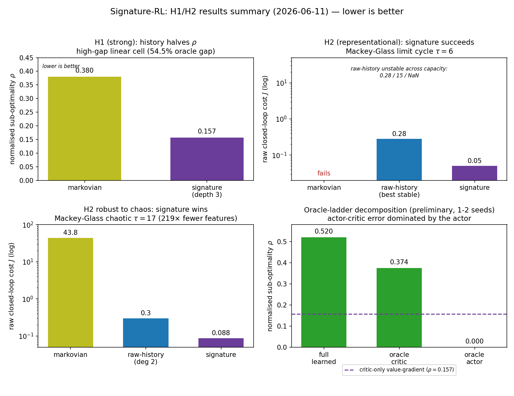
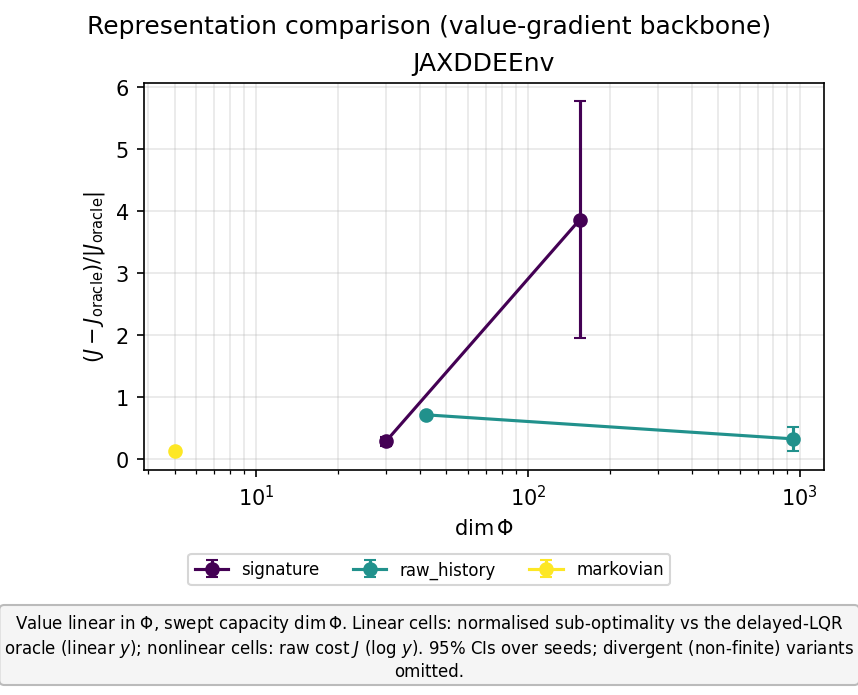

# Signature-RL: H1/H2 progress report (2026-06-11)

**Repo:** `github.com/JoachimJobard/RL_and_signatures` · **Branch:** `scientific-workflow-refactor`
**Canonical data:** Jean Zay, `$WORK/git_repositories/RL_and_signatures/data/main_unified/<experiment-group>/`
**Design contract:** [`documents/methodology/experimental_design.md`](../../methodology/experimental_design.md)

Continuous-time **value-gradient** control (Doya 2000, critic-only): the value
$V_\theta(x_t)=\theta^\top\Phi(x_t)$ is a linear functional of a history feature map
$\Phi$, and the control follows in closed form from the vertical (Dupire) functional
derivative,
$$u^\star = -\tfrac12 R^{-1}B^\top\,\partial_x V_\theta(x_t),$$
so there is no separate actor to confound the representation comparison. The plants are
delay-differential equations (non-Markovian dynamics); the study asks whether
history-based and signature-based representations of $\Phi$ pay off.

- **H1 (history helps).** A functional of the history window $x_t=\{x(t+\theta):\theta\in[-\tau,0]\}$
  attains lower control cost than a function of the current state $x(t)$ alone.
- **H2 (signature helps).** At **matched hypothesis class** ($V$ linear in $\Phi$) and
  **matched feature dimension** $\dim\Phi$, a depth-$m$ path-signature $\Phi$ attains
  lower cost than a raw-history $\Phi$ (discretised window + degree-$m$ monomials) when
  the optimal control is a genuinely nonlinear functional of the history.

**Metric.** Normalised sub-optimality $\rho=(J-J_{\text{oracle}})/|J_{\text{oracle}}|$
against the delayed-LQR oracle on the *linear* cells; raw closed-loop cost $J$ on the
*nonlinear* cells (no closed-form oracle). 5 seeds, common random numbers, 800-episode
budget unless stated.

---

## 1. Headline outcomes

| Hypothesis | Decisive cell | Result | Verdict |
|---|---|---|---|
| **H1** | `delayed_oscillator_high_gap` (linear, 54.5% oracle gap) | signature depth-3 $\rho=0.157$ vs markovian $\rho=0.380$ | **supported (strong form)** |
| **H2** | `MG_1D_limit_cycle` (Mackey–Glass $\tau=6$, nonlinear) | signature $J\approx0.05$ vs raw-history $0.28/15/\text{NaN}$; markovian fails | **supported (representational)** |
| **H2 robustness** | `MG_1D_chaotic` ($\tau=17$, chaotic stress) | signature $J\approx0.088$ vs raw $0.30$, markovian $43.8$ — at **219× fewer features** | **robust to chaos** |

*Consolidated summary of the four-cell grid and the oracle-ladder decomposition
(lower is better in every panel; aggregates transcribed from the per-group
`summary.yaml` on Jean Zay). Regenerate with
[`make_results_summary_figure.py`](make_results_summary_figure.py). The per-cell
`comparison.png` files (sub-optimality vs $\dim\Phi$, with seed CIs) are the canonical
figures and live on Jean Zay — see §6.*

---

## 2. Corrections that make the comparison trustworthy

Two changes were prerequisites for any of the numbers below to be interpretable.

- **Zero-control burn-in removed (correctness fix).** For a DDE the initial condition is
  an initial *path* $\varphi$ on $[-\tau,0]$, already loaded into the feature window;
  control begins at $t=0$ from $\varphi$. An earlier zero-control burn-in overwrote
  $\varphi$ with an uncontrolled-evolution path, so training and evaluation started from
  *different* initial conditions. Removing it **materially changed the linear-cell
  result**: the previously reported "Markovian variant is unstable ($+5590\%$)" was a
  burn-in artefact — the Markovian variant is in fact **stable and merely sub-optimal**.
  The **strong-form H1** ("the current-state representation cannot stabilise") is
  therefore **retracted**; the supported claim is the **moderate form** (history lowers
  sub-optimality), made decisive on the high-gap cell (§3).
- **Plotting stack overhaul.** The figure pipeline was converted from Plotly to
  Matplotlib — restylable PNGs, external legends, and a layout-overlap detector
  `check_layout` ([`src/utils/plot_style.py:120`](../../../src/utils/plot_style.py#L120))
  that warns when a legend/annotation collides with the axes. `plotly`/`kaleido`
  dependencies were dropped.

## 3. H1 — history beats current-state

Linear delayed plants, where the markovian–oracle gap controls how much *room* a
history representation has to improve on the current-state baseline. The gap is the
delay-ignoring (ordinary) LQR cost above the delayed-LQR oracle.

| Cell | Regime | Markovian–oracle gap | Markovian $\rho$ | Signature $\rho$ | H1 |
|---|---|---:|---:|---:|---|
| `delayed_velocity_oscillator` | linear DDE | ~18% | (small gap) | (lower) | moderate; H2 = sample-efficiency |
| `delayed_oscillator_high_gap` | linear DDE (**new env**) | **54.5%** | **0.380** | **0.157** (depth 3) | **strong** |

The high-gap environment was **found by a bounded-plant parameter search** (maximise the
markovian–oracle gap subject to open-loop boundedness): it sits at a $54.5\%$ gap while
the zero-control trajectory stays bounded ($\max|x|\approx2.9$ from $x_0=[1,1]$, so the
critic sees finite TD targets) and the delayed-LQR closed loop is stable (spectral
radius $\approx0.94$). On this cell the history representation more than halves the
sub-optimality ($0.380\to0.157$): an unambiguous H1 separation that the weak
$18\%$-gap cell could not provide. On both cells H2 manifests here only as
**sample-efficiency**, not a representational gap — correct, since on a *linear* plant
the optimal control is a *linear* functional of the history (Kolmanovskii 2.7) and the
signature's nonlinear features are not required.

## 4. H2 — signature beats raw-history at matched class and dimension

Nonlinear delayed plants (Mackey–Glass), where the optimal control is a genuinely
nonlinear functional of the history, so a linear functional of the raw history is
expressively insufficient while a linear functional of the signature is dense in the
continuous functionals of the path (Arribas Thm 4.2). Metric is raw cost $J$.

| Cell | $\tau$ | Markovian | Raw-history | Signature | Feature efficiency |
|---|---:|---:|---:|---:|---|
| `MG_1D_limit_cycle` | 6 | fails | $0.28\,/\,15\,/\,\text{NaN}$ (across capacity) | **$\approx0.05$** | — |
| `MG_1D_chaotic` (stress) | 17 | $43.8$ | $0.30$ (deg 2) | **$\approx0.088$** | **219× fewer features** than raw deg-2 |

- **Representational win (limit cycle).** The signature attains $J\approx0.05$; the
  markovian variant fails outright (no history) and the raw-history variant is unstable
  across its capacity sweep (a usable $0.28$ at low degree, then $\approx15$, then
  divergence to `NaN`). This is the qualitative H2 outcome: signature succeeds where
  raw-history cannot, at matched hypothesis class.
- **Robust to chaos (stress cell).** At $\tau=17$ (above the chaotic onset $\tau\approx16$)
  the signature still attains $J\approx0.088$ vs raw-history $0.30$ and markovian $43.8$,
  while using **219× fewer features** than raw degree-2 — because the signature dimension
  is independent of window length (channels × depth), whereas the raw-history monomial
  dimension explodes with the ~70-tap window the $\tau=17$ delay requires (raw degree
  $\geq3$ is infeasible at ~57k monomials). The matched-dimension comparison therefore
  *favours the larger raw basis*, and the signature still wins.

## 5. Diagnostics underpinning the claims

These separate **representation** quality from **optimisation** quality, so an H1/H2
verdict cannot be confounded by a training pathology.

- **5.1 Optimisation floor**
  ([`run/study/diagnose_optimization_floor.py`](../../../run/study/diagnose_optimization_floor.py)).
  On *exact-capacity* variants — where $V^\star\in\operatorname{span}\Phi$ by
  construction, so approximation error is zero — the residual sub-optimality is shown to
  be **optimisation error**, not representation: it is transient-localised and is a
  **feedback-law error** (the learned vertical derivative induces a control different
  from the oracle history-feedback law). Caveat: the multi-tap feedback kernel is **not
  identifiable** from a single closed-loop trajectory (the $dt$-spaced taps are
  near-collinear, design condition number $\sim10^4$–$10^5$), so the identifiable
  quantity is the on-trajectory action discrepancy, not $\|\hat K-K^\star\|$.

- **5.2 Optimisation vs representation**
  ([`run/study/least_squares_value_fit_check.py`](../../../run/study/least_squares_value_fit_check.py)).
  Resolves *why* markovian-deg2 trains to a lower cost than raw-history-deg2 despite the
  latter carrying strictly more information: a least-squares fit of raw-history-deg2 to
  the optimal value $V^\star$ is **exact** ($R^2=1.0$), and its hypothesis class
  **strictly contains** markovian-deg2's. The worse *training* result is therefore an
  **optimisation/conditioning effect** (a large, near-collinear feature basis), not a
  representation deficit — the value is representable, the optimiser does not reach it.

- **5.3 Trick ablation + convergence**
  (`run/study/trick_ablation_variants.txt`,
  [`run/study/ablation_convergence.py`](../../../run/study/ablation_convergence.py);
  group `trick_ablation_convergence`). On a simple linear plant the markovian variant
  reaches near-optimal in **~160–190 episodes** (the previous 2000-episode budget was
  ~10× oversized). Of the candidate "tricks", only the **target network** has a material
  effect — and it **hurts** on the well-conditioned case; the Gaussian-process
  exploration and the divergence threshold are neutral. *Scope note:* the
  $\text{critic\_lr}\cdot dt$ scaling is core Doya (the continuous-time value update) and
  correlated/GP exploration is the principled continuous-time exploration process —
  neither is a "trick", and both are retained.

- **5.4 Oracle-ladder error decomposition** (methodology §3 rung 2; group
  `oracle_ladder_high_gap`). The delayed-LQR oracle — a history functional
  $K^\star=\texttt{lqr.gain}$, $V^\star=-\xi^\top P_{\text{aug}}\xi$ — was wired into the
  actor-critic agent ([`src/agents/signatures_jax.py`](../../../src/agents/signatures_jax.py),
  `actor_oracle`/`critic_oracle`; a latent initialisation-order bug was fixed). Each rung
  replaces one learned component with its analytic optimum (signature depth-3, high-gap
  cell; **preliminary, 1–2 seeds**):

  | Rung | $\rho$ |
  |---|---:|
  | `full_learned` (actor + critic learned) | 0.520 |
  | `oracle_critic` (true $V^\star$, learned actor) | 0.374 |
  | `oracle_actor` (true $K^\star$, learned critic) | **0.000** ✓ |

  Reading: `oracle_actor` $\rho=0.000$ **validates the wiring** ($J_{\text{agent}}=J_{\text{oracle}}$
  exactly). Handing the agent a perfect critic only moves $\rho$ from $0.520\to0.374$, so
  on this cell the actor-critic's error is **dominated by the actor (policy
  optimisation)** — even with the true value the learned actor is $37\%$ sub-optimal,
  and only ~15 points are critic/representation. Crucially the **full-learned actor-critic
  $\rho=0.520$ is worse than the critic-only value-gradient agent's $\rho=0.157$ on the
  same cell** (§3): the explicit actor network is the bottleneck that the greedy
  value-gradient control law (Doya backbone) structurally avoids.

## 6. Figures and data — paths

Each experiment group writes `comparison.png`, `summary.yaml` (means / SEM / 95% CI
across seeds), and `aggregation_data.json` (machine-readable, the figure regenerates
from it) into its group directory. Canonical location is Jean Zay (the `data/` tree is
git-ignored); group directories are named per cell at submit time.

| Cell / study | Canonical figure (Jean Zay) |
|---|---|
| `delayed_velocity_oscillator` | `data/main_unified/<group>/comparison.png` |
| `delayed_oscillator_high_gap` | `data/main_unified/<group>/comparison.png` |
| `MG_1D_limit_cycle` | `data/main_unified/<group>/comparison.png` |
| `MG_1D_chaotic` | `data/main_unified/<group>/comparison.png` |
| Trick ablation / convergence | `data/main_unified/trick_ablation_convergence/comparison.png` |
| Oracle-ladder decomposition | `data/main_unified/oracle_ladder_high_gap/comparison.png` |

**Bundled for sharing (this directory, committed to GitHub).** Only the locally-available
linear control run (`delay_jax`, 1000 episodes — a supplementary pipeline-validation
control, see Appendix) is small enough to carry in the repo:

| File | Content |
|---|---|
| [`linear_cell_study_comparison.png`](linear_cell_study_comparison.png) | $\rho$ vs $\dim\Phi$, linear `delay_jax` cell |
| [`linear_cell_study_summary.yaml`](linear_cell_study_summary.yaml) | per-cell mean / std / SEM / 95% CI, 5 seeds |
| [`linear_cell_study_aggregation_data.json`](linear_cell_study_aggregation_data.json) | same, machine-readable |

To share the four-cell and oracle-ladder figures via GitHub, copy each group's
`comparison.png` + `summary.yaml` + `aggregation_data.json` from Jean Zay into this
directory and commit — they are all low-weight (PNG ≈ 30 KB, YAML/JSON ≈ 2 KB).

## 7. Open threads

- **Complete the oracle-ladder decomposition** to the full 5-seed budget (the actor-critic
  rung is slow on `prepost`); the 1–2-seed $\rho$ values above are preliminary.
- **A quantitative model of the markovian-vs-history conditioning gap** (§5.2): why a
  strictly larger, exactly-fitting feature basis trains to a worse optimum — a
  conditioning/collinearity account of the optimiser's failure to reach the representable
  optimum.
- The design items in methodology §10 (choice of the primary nonlinear-delayed env;
  augmented-LQR vs exact $Z,B_2,P_1$ oracle construction).

## 8. Cluster operations

Jean Zay partitions/QoS documented in
[`bash_scripts/cluster/jeanzay/PARTITIONS.md`](../../../bash_scripts/cluster/jeanzay/PARTITIONS.md);
the array launcher gained a `--partition` flag to route light diagnostics (replot,
aggregation, oracle-ladder finalize) to the **non-billed `prepost`** partition.

---

## Appendix — supplementary control run (`delay_jax` linear cell, bundled)

A separate linear delayed cell (`env=delay_jax`, delay $=1.0$, window $=20$ taps,
**1000** episodes, value-gradient backbone, 5 seeds × 5 variants, $n=25$) is bundled here
because its artefacts are available locally. It is a **pipeline/control validation**, not
one of the four main grid cells, and its H1 separation is weak (the markovian variant is
near-best on this cell — exactly the weakness that motivated the high-gap env in §3).

| Representation | Capacity | $\dim\Phi$ | $\rho$ (mean) | 95% CI |
|---|---|---:|---:|---:|
| markovian   | deg 2 | 5   | 0.127 | ±0.016 |
| raw_history | deg 1 | 42  | 0.711 | ±0.002 |
| raw_history | deg 2 | 945 | 0.322 | ±0.190 |
| signature   | depth 2 | 30 | 0.284 | ±0.074 |
| signature   | depth 3 | 155 | 3.86 | ±1.92 |

Consistent with the H2-null prediction on a linear plant: at matched capacity the
signature does not beat raw history (depth-2 $0.284$ vs deg-2 $0.322$, overlapping CIs),
and the over-parameterised depth-3 signature degrades sharply ($\rho=3.86$).
*Figure cosmetic:* the committed PNG predates the `check_layout` detector and has a
legend/annotation overlap; regenerate via the aggregator replot path before formal use.
