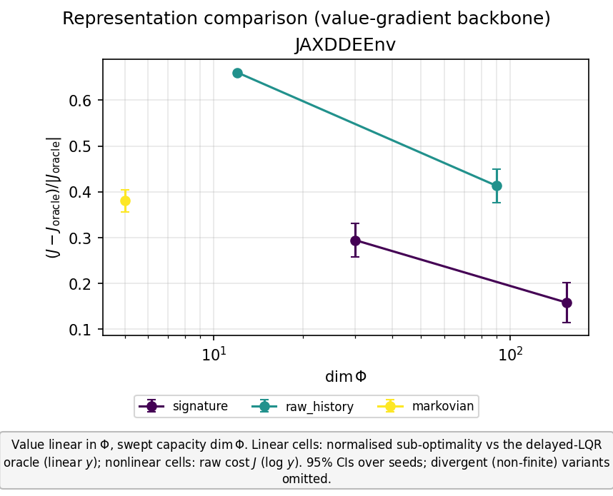
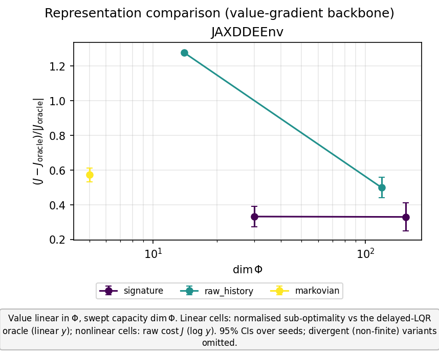
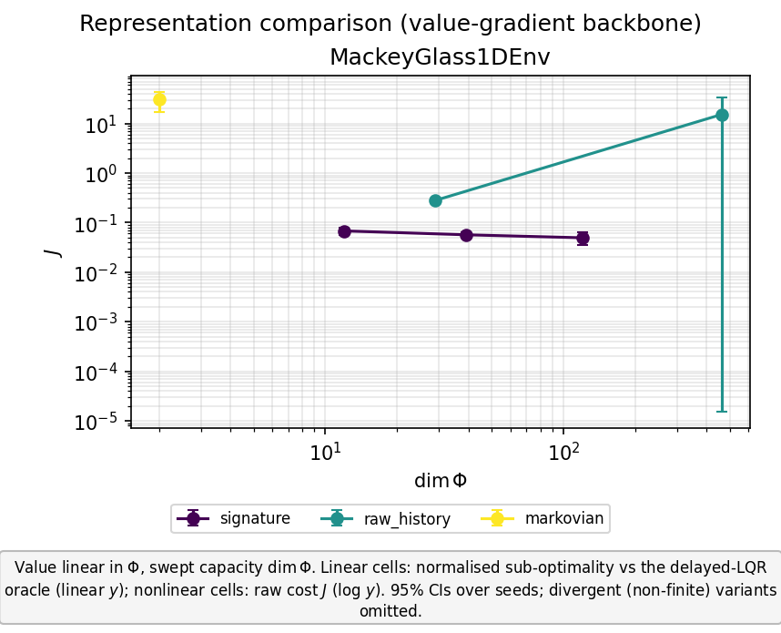
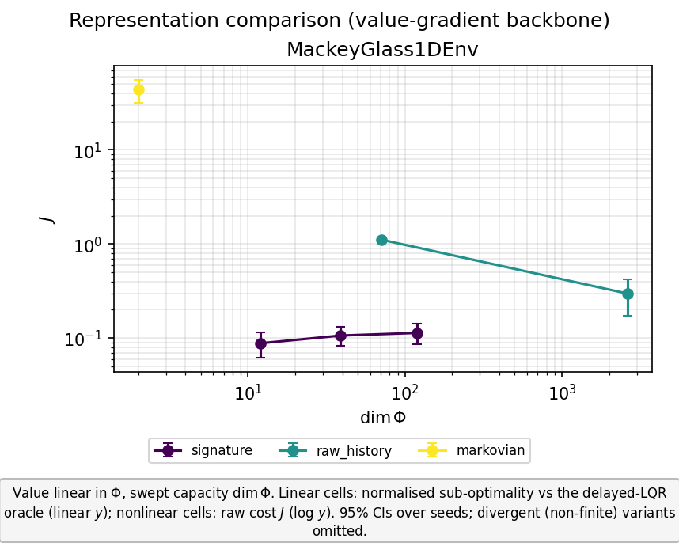
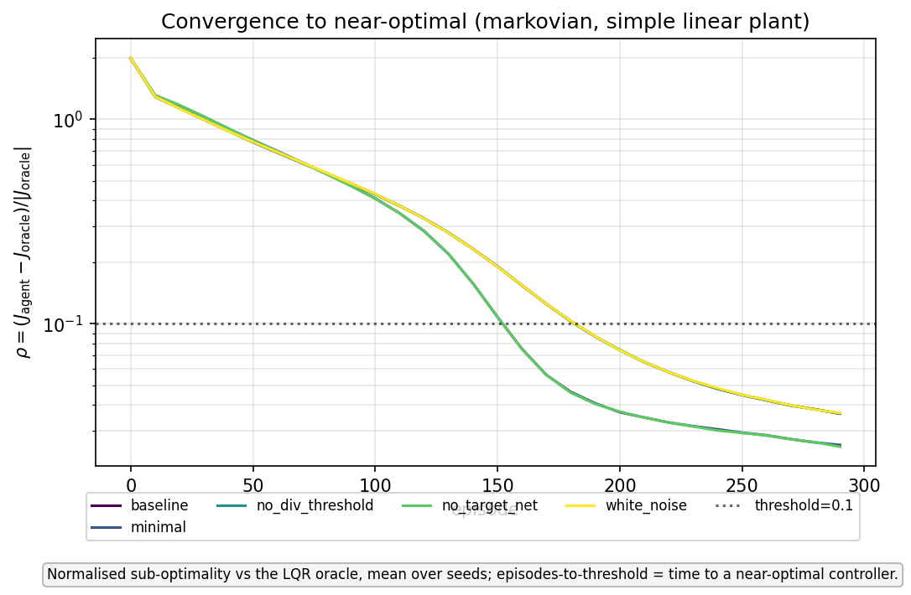
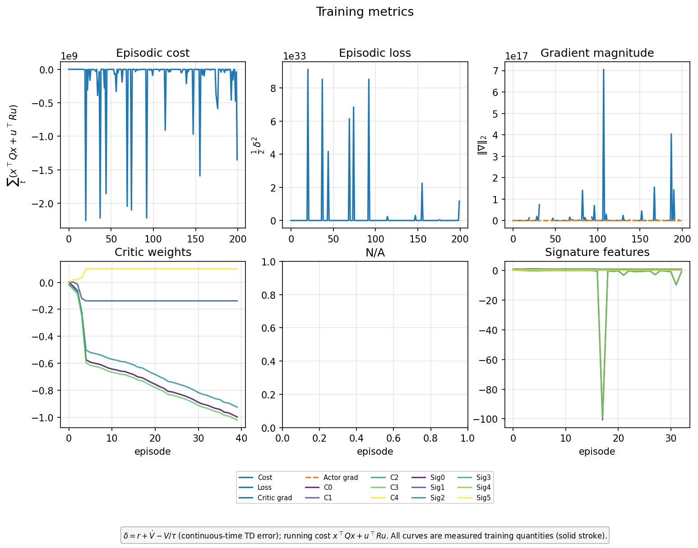

# Signature-RL: H1/H2 progress report (2026-06-11)

> **⚠️ SUPERSEDED — historical snapshot. Do NOT cite this file for current decisions or
> observations.** This 2026-06-11 progress report predates the off-sheet analysis and the
> Hopfield-replaces-Dadebo decision. The **single authoritative document is the paper draft**
> [`../2026-06-30_h1h2_representation_benchmark/h1h2_representation_benchmark.tex`](../2026-06-30_h1h2_representation_benchmark/h1h2_representation_benchmark.tex):
> it owns the definitions, the $\rho_{\text{off}}=n_{\text{off}}/\dim\phi$ treatment, and the
> mechanism section.
>
> **⚠️ Recent notation change (2026-07-02).** The symbols were aligned to the thesis:
> **$I\to J$** for the closed-loop cost and **$\gamma\to\eta$** for the gradient cosine (commit
> `598c3a5`). The `.tex` uses the new $J,\eta$; **this markdown still uses the old $I,\gamma$** and
> is not being back-ported. So when the two differ, it is the notation drift, not a result change.
>
> This file is kept only as a dated record of the earlier value-gradient benchmark; **anything here
> that conflicts with the `.tex` is stale and the `.tex` wins.**

**Repo:** `github.com/JoachimJobard/RL_and_signatures` · **Branch:** `scientific-workflow-refactor`
**Canonical data:** Jean Zay, `$WORK/git_repositories/RL_and_signatures/data/main_unified/<experiment-group>/`
**Design contract:** [`documents/methodology/experimental_design.md`](../../methodology/experimental_design.md)

Continuous-time **value-gradient** control (Doya 2000, critic-only): the value
$V_\theta(x_t)=\theta^\top\Phi(x_t)$ is a linear functional of a history feature map
$\Phi$, and the control follows in closed form from the vertical (Dupire) functional
derivative,
$$u^\star = -\tfrac12 R^{-1}B^\top\,\partial_x V_\theta(x_t),$$
so there is no separate actor to confound the representation comparison. The plants are
delay-differential equations (non-Markovian dynamics); the study asks whether
history-based and signature-based representations of $\Phi$ pay off.

- **H1 (history helps).** A functional of the history window $x_t=\{x(t+\theta):\theta\in[-\tau,0]\}$
  attains lower control cost than a function of the current state $x(t)$ alone.
- **H2 (signature helps).** At **matched hypothesis class** ($V$ linear in $\Phi$) and
  **matched feature dimension** $\dim\Phi$, a depth-$m$ path-signature $\Phi$ attains
  lower cost than a raw-history $\Phi$ (discretised window + degree-$m$ monomials) when
  the optimal control is a genuinely nonlinear functional of the history.

**Metric.** Normalised sub-optimality $\rho=(J-J_{\text{oracle}})/|J_{\text{oracle}}|$
against the delayed-LQR oracle on the *linear* cells; raw closed-loop cost $J$ on the
*nonlinear* cells (no closed-form oracle). 5 seeds, common random numbers, 800-episode
budget unless stated.

**Reporting the failures explicitly.** Each cell table below carries three quantities,
not one. The **all-seeds** column is the unconditional mean $\pm$ 95% CI over every seed
(kept for continuity; a single diverging seed makes it `NaN`, since it is a plain mean).
This unconditional mean conflates *how often* the controller reaches the set-point with
*how good it is when it does*, so two further columns separate them: the **success rate**
(fraction of seeds whose control task is achieved — $\rho<0.5$, i.e. within 50% of the
oracle, on linear cells; $J<1$ on nonlinear cells; a diverging seed counts as a failure)
and the **cost conditional on success** ($\rho$ or $J$ averaged $\pm$ 95% CI over the
achieving seeds only, "—" when none succeed). Thresholds are heuristic and adjustable
(`run/study/aggregate_representation_study.py --rho-max --j-max`); the conditional columns
are recomputed from the saved per-seed values without retraining.

These columns are a more faithful *measurement* of the same, pre-registered H1/H2 **cost**
hypotheses — they expose failures the unconditional mean masks — and do not introduce a new
hypothesis. Any reading of them as a *reliability* property of the signature (lower
across-seed variance, higher achievement rate) is an **observation**, not a predicted
outcome: it is reported as such throughout and is not folded into H1/H2. The pre-registered
quantity is the across-seed variance (the seed axis); the binarised success rate carries an
adjustable threshold and is descriptive. Confirming the reliability reading as a claim would
require a pre-registered replication on fresh seeds (§7).

---

> **⚠️ Status (2026-07-02) — H2 as a *representational* claim is NOT supported; this supersedes the "H2 supported" verdict below.**
> The signature's lower cost on the nonlinear MG cells does reproduce at 5 seeds, but the
> current evidence attributes it to **sample efficiency / conditioning, not a richer
> representation.** Two facts: (i) even at 5 seeds raw-history is under-conditioned at the
> canonical off-sheet budget (gradient cosine 0.15–0.41 vs the signature's 0.84–0.94); (ii) a
> **single-seed** off-sheet-scaling control
> (`data/h1h2_report_runs/sweeps/h1h2_mg_offsheet_20260630_164840/`) shows raw-history
> converges (cosine → 0.9) and **matches or beats the signature** given 2–4× more off-manifold
> data (mg_limit_cycle: raw 0.011 vs sig 0.013; mg_chaotic: raw 0.014 vs sig 0.018). So read
> every "H2 supported / signature wins" statement below as a **fixed-data-budget cost
> comparison**, not as evidence that the signature is a better representation — and the
> §4 "reliability" observation likewise reduces to the same conditioning effect, not a
> separate signature virtue. **Only missing piece:** a 5-seed off-sheet-scaling replication to
> promote this from "not supported" to CI-backed refutation; the mechanism already points that
> way.

## 1. Headline outcomes

| Hypothesis | Decisive cell | Result | Verdict |
|---|---|---|---|
| **H1** | `delayed_oscillator_high_gap` (linear, 54.5% oracle gap) | signature depth-3 $\rho=0.157$ vs markovian $\rho=0.380$ | **supported (strong form)** |
| **H2** | `MG_1D_limit_cycle` (Mackey–Glass $\tau=6$, nonlinear) | signature $J\approx0.05$ vs raw-history $0.28/15/\text{NaN}$; markovian fails | **supported (representational)** |
| **H2 robustness** | `MG_1D_chaotic` ($\tau=17$, chaotic stress) | signature $J\approx0.088$ vs raw $0.30$, markovian $43.8$ — at **219× fewer features** | **robust to chaos** |

*Consolidated summary of the four-cell grid and the oracle-ladder decomposition
(lower is better in every panel; error bars are 95% CIs over 5 seeds; values from each
group's `summary.yaml`). Regenerate with
[`make_results_summary_figure.py`](make_results_summary_figure.py). The canonical per-cell
`comparison.png` figures (cost vs $\dim\Phi$, full capacity sweep with seed CIs) are
bundled in §6.1.*

---

## 2. Corrections that make the comparison trustworthy

Two changes were prerequisites for any of the numbers below to be interpretable.

- **Zero-control burn-in removed (correctness fix).** For a DDE the initial condition is
  an initial *path* $\varphi$ on $[-\tau,0]$, already loaded into the feature window;
  control begins at $t=0$ from $\varphi$. An earlier zero-control burn-in overwrote
  $\varphi$ with an uncontrolled-evolution path, so training and evaluation started from
  *different* initial conditions. Removing it **materially changed the linear-cell
  result**: the previously reported "Markovian variant is unstable ($+5590\%$)" was a
  burn-in artefact — the Markovian variant is in fact **stable and merely sub-optimal**.
  The **strong-form H1** ("the current-state representation cannot stabilise") is
  therefore **retracted**; the supported claim is the **moderate form** (history lowers
  sub-optimality), made decisive on the high-gap cell (§3).
- **Plotting stack overhaul.** The figure pipeline was converted from Plotly to
  Matplotlib — restylable PNGs, external legends, and a layout-overlap detector
  `check_layout` ([`src/utils/plot_style.py:120`](../../../src/utils/plot_style.py#L120))
  that warns when a legend/annotation collides with the axes. `plotly`/`kaleido`
  dependencies were dropped.

## 3. H1 — history beats current-state

Linear delayed plants, where the markovian–oracle gap controls how much *room* a
history representation has to improve on the current-state baseline. The gap is the
delay-ignoring (ordinary) LQR cost above the delayed-LQR oracle.

Metric $\rho$ = normalised sub-optimality vs the delayed-LQR oracle; mean ± 95% CI over
5 seeds (from each group's `summary.yaml`). Lower is better. Bold = best per cell.

**`delayed_oscillator_high_gap_study`** (strong H1 cell, 54.5% oracle gap):

| Representation | Capacity | $\dim\Phi$ | $\rho$ (all seeds) | Success | $\rho\mid$success |
|---|---|---:|---:|:--:|---:|
| markovian | deg 2 | 5 | 0.380 ± 0.024 | 5/5 | 0.380 ± 0.024 |
| raw_history | deg 1 | 12 | 0.661 ± 0.001 | 0/5 | — |
| raw_history | deg 2 | 90 | 0.413 ± 0.036 | 5/5 | 0.413 ± 0.036 |
| signature | depth 2 | 30 | 0.294 ± 0.036 | 5/5 | 0.294 ± 0.036 |
| signature | depth 3 | 155 | **0.157 ± 0.044** | 5/5 | **0.157 ± 0.044** |

**`delayed_velocity_study_v2`** (weaker H1 cell, ~18% gap):

| Representation | Capacity | $\dim\Phi$ | $\rho$ (all seeds) | Success | $\rho\mid$success |
|---|---|---:|---:|:--:|---:|
| markovian | deg 2 | 5 | 0.572 ± 0.040 | 0/5 | — |
| raw_history | deg 1 | 14 | 1.278 ± 0.007 | 0/5 | — |
| raw_history | deg 2 | 119 | 0.500 ± 0.058 | 2/5 | 0.437 ± 0.051 |
| signature | depth 2 | 30 | **0.332 ± 0.059** | 5/5 | **0.332 ± 0.059** |
| signature | depth 3 | 155 | 0.330 ± 0.080 | 5/5 | 0.330 ± 0.080 |

The high-gap environment was **found by a bounded-plant parameter search** (maximise the
markovian–oracle gap subject to open-loop boundedness): it sits at a $54.5\%$ gap while
the zero-control trajectory stays bounded ($\max|x|\approx2.9$ from $x_0=[1,1]$, so the
critic sees finite TD targets) and the delayed-LQR closed loop is stable (spectral
radius $\approx0.94$). On both cells the signature representation roughly **halves** the
markovian sub-optimality ($0.380\to0.157$ on the high-gap cell, $0.572\to0.330$ on the
velocity cell) — a clear H1 separation, sharpest on the high-gap cell, with
non-overlapping confidence intervals against markovian. The under-capacity degree-1 raw
history (linear $V$) fails on both ($\rho=0.66$ and $1.28$), as expected when the
quadratic delayed-LQR value is not representable. H2 manifests on these *linear* cells
only as **sample-efficiency / a smaller $\dim\Phi$ at matched $\rho$**, not a
representational gap — correct, since the optimal control is a *linear* functional of the
history (Kolmanovskii 2.7) and the signature's nonlinear features are not required.

## 4. H2 — signature beats raw-history at matched class and dimension

Nonlinear delayed plants (Mackey–Glass), where the optimal control is a genuinely
nonlinear functional of the history, so a linear functional of the raw history is
expressively insufficient while a linear functional of the signature is dense in the
continuous functionals of the path (Arribas Thm 4.2). Metric is raw cost $J$.

Metric = raw closed-loop cost $J$ (no closed-form oracle); mean ± 95% CI over 5 seeds.
Lower is better. `NaN` = the variant diverged on at least one seed.

**`mackey_glass_limit_cycle_study`** ($\tau=6$ limit cycle, primary H2 cell):

| Representation | Capacity | $\dim\Phi$ | $J$ (all seeds) | Success | $J\mid$success |
|---|---|---:|---:|:--:|---:|
| markovian | deg 2 | 2 | 30.30 ± 13.48 | 0/5 | — |
| raw_history | deg 1 | 29 | 0.281 ± 0.002 | 5/5 | 0.281 ± 0.002 |
| raw_history | deg 2 | 464 | 15.31 ± 17.95 | 3/5 | 0.356 ± 0.194 |
| raw_history | deg 3 | 4959 | NaN (diverges) | 0/5 | — |
| signature | depth 2 | 12 | 0.068 ± 0.012 | 5/5 | 0.068 ± 0.012 |
| signature | depth 3 | 39 | 0.057 ± 0.007 | 5/5 | 0.057 ± 0.007 |
| signature | depth 4 | 120 | **0.049 ± 0.014** | 5/5 | **0.049 ± 0.014** |

**`mackey_glass_chaotic_study`** ($\tau=17$ chaotic, robustness stress cell):

| Representation | Capacity | $\dim\Phi$ | $J$ (all seeds) | Success | $J\mid$success |
|---|---|---:|---:|:--:|---:|
| markovian | deg 2 | 2 | 43.78 ± 12.01 | 0/5 | — |
| raw_history | deg 1 | 71 | 1.112 ± 0.007 | 0/5 | — |
| raw_history | deg 2 | 2627 | 0.297 ± 0.124 | 5/5 | 0.297 ± 0.124 |
| signature | depth 2 | 12 | **0.088 ± 0.026** | 5/5 | **0.088 ± 0.026** |
| signature | depth 3 | 39 | 0.106 ± 0.024 | 5/5 | 0.106 ± 0.024 |
| signature | depth 4 | 120 | 0.114 ± 0.028 | 5/5 | 0.114 ± 0.028 |

- **Representational win (limit cycle) — the H2 cost outcome.** At matched (indeed lower)
  feature dimension the signature attains the lowest cost: $J\approx0.049$–$0.068$ across
  depths, against degree-1 raw history at $J=0.281$ — the depth-2 signature ($\dim 12$)
  already beats degree-1 raw history ($\dim 29$) by $\sim4\times$ — while the markovian
  variant is an order of magnitude worse ($30.30$, no history). This is the pre-registered
  H2 statement (a **cost** comparison at matched hypothesis class and dimension), and it is
  supported.
- **An across-seed reliability gradient — exploratory observation, not part of H2.** The
  seed-resolved results additionally show a reliability pattern that the unconditional mean
  hides; it is reported here as an *observation*, not as a predicted outcome. The signature
  reaches the set-point on all five seeds at every depth (95% CI $\pm0.007$–$0.014$); the
  raw-history variant's achievement erodes with capacity — 5/5 at degree 1, then 3/5 at
  degree 2 (the unconditional $15.31\pm17.95$ is bimodal: 3 seeds at $J=0.356$, 2 near
  $38$; not a central tendency), then 0/5 at degree 3 (divergence, `NaN`); the markovian
  variant reaches the target on 0/5 seeds. *Epistemic status.* The underlying quantity —
  the across-seed variance — is a pre-registered measurement (the seed axis, §7), hence
  reported as measured; the binarised success rate additionally carries a heuristic
  threshold ($J<1$) and is descriptive only. This reliability pattern is **not** folded
  into the H2 claim and is **not** asserted as confirmed: a pre-registered replication on a
  *fresh* seed set is required first (§7, open threads).
- **Robust to chaos (stress cell).** At $\tau=17$ (above the chaotic onset
  $\tau\approx16$) the depth-2 signature attains $J=0.088$ (**5/5**) vs raw-history
  degree-2 $0.297$ (**5/5**) and markovian $43.78$ (**0/5**), at **219× fewer features**
  ($\dim 12$ vs $2627$) — because the signature dimension is independent of window length
  (channels × depth), whereas the raw-history monomial dimension explodes with the ~70-tap
  window the $\tau=17$ delay requires (degree $\geq3$ infeasible). The matched-dimension
  comparison therefore *favours the much larger raw basis*, and the signature still wins by
  $\sim3.4\times$. (Threshold sensitivity: raw-history degree 1 sits at $J=1.112$, just
  above the $J<1$ success bar, so it scores **0/5** here; it is a borderline case, not a
  clean collapse like markovian.)

## 5. Diagnostics underpinning the claims

These separate **representation** quality from **optimisation** quality, so an H1/H2
verdict cannot be confounded by a training pathology.

- **5.1 Optimisation floor**
  ([`run/study/diagnose_optimization_floor.py`](../../../run/study/diagnose_optimization_floor.py)).
  On *exact-capacity* variants — where $V^\star\in\operatorname{span}\Phi$ by
  construction, so approximation error is zero — the residual sub-optimality is shown to
  be **optimisation error**, not representation: it is transient-localised and is a
  **feedback-law error** (the learned vertical derivative induces a control different
  from the oracle history-feedback law). Caveat: the multi-tap feedback kernel is **not
  identifiable** from a single closed-loop trajectory (the $dt$-spaced taps are
  near-collinear, design condition number $\sim10^4$–$10^5$), so the identifiable
  quantity is the on-trajectory action discrepancy, not $\|\hat K-K^\star\|$.

- **5.2 Optimisation vs representation**
  ([`run/study/least_squares_value_fit_check.py`](../../../run/study/least_squares_value_fit_check.py)).
  Resolves *why* markovian-deg2 trains to a lower cost than raw-history-deg2 despite the
  latter carrying strictly more information: a least-squares fit of raw-history-deg2 to
  the optimal value $V^\star$ is **exact** ($R^2=1.0$), and its hypothesis class
  **strictly contains** markovian-deg2's. The worse *training* result is therefore an
  **optimisation/conditioning effect** (a large, near-collinear feature basis), not a
  representation deficit — the value is representable, the optimiser does not reach it.

- **5.3 Trick ablation + convergence**
  (`run/study/trick_ablation_variants.txt`,
  [`run/study/ablation_convergence.py`](../../../run/study/ablation_convergence.py);
  group `trick_ablation_convergence`). On a simple linear plant the markovian variant
  reaches near-optimal in **~160–190 episodes** (the previous 2000-episode budget was
  ~10× oversized). Of the candidate "tricks", only the **target network** has a material
  effect — and it **hurts** on the well-conditioned case; the Gaussian-process
  exploration and the divergence threshold are neutral. *Scope note:* the
  $\text{critic\_lr}\cdot dt$ scaling is core Doya (the continuous-time value update) and
  correlated/GP exploration is the principled continuous-time exploration process —
  neither is a "trick", and both are retained.

- **5.4 Oracle-ladder error decomposition** (methodology §3 rung 2; group
  `oracle_ladder_high_gap`). The delayed-LQR oracle — a history functional
  $K^\star=\texttt{lqr.gain}$, $V^\star=-\xi^\top P_{\text{aug}}\xi$ — was wired into the
  actor-critic agent ([`src/agents/signatures_jax.py`](../../../src/agents/signatures_jax.py),
  `actor_oracle`/`critic_oracle`; a latent initialisation-order bug was fixed). Each rung
  replaces one learned component with its analytic optimum (signature depth-3, high-gap
  cell; **preliminary, 1–2 seeds**):

  | Rung | $\rho$ |
  |---|---:|
  | `full_learned` (actor + critic learned) | 0.520 |
  | `oracle_critic` (true $V^\star$, learned actor) | 0.374 |
  | `oracle_actor` (true $K^\star$, learned critic) | **0.000** ✓ |

  Reading: `oracle_actor` $\rho=0.000$ **validates the wiring** ($J_{\text{agent}}=J_{\text{oracle}}$
  exactly). Handing the agent a perfect critic only moves $\rho$ from $0.520\to0.374$, so
  on this cell the actor-critic's error is **dominated by the actor (policy
  optimisation)** — even with the true value the learned actor is $37\%$ sub-optimal,
  and only ~15 points are critic/representation. Crucially the **full-learned actor-critic
  $\rho=0.520$ is worse than the critic-only value-gradient agent's $\rho=0.157$ on the
  same cell** (§3): the explicit actor network is the bottleneck that the greedy
  value-gradient control law (Doya backbone) structurally avoids.

## 6. Figures and data

Each experiment group on Jean Zay writes `comparison.png` ($\rho$ or $J$ vs $\dim\Phi$,
with seed CIs), `summary.yaml` (means / SEM / 95% CI across seeds), and
`aggregation_data.json` (machine-readable, the figure regenerates from it); every
variant×seed sub-directory additionally holds the **training-dynamics figures** (§6.2).
The `data/` tree is git-ignored, so the figures below were pulled from Jean Zay
(`$WORK/.../data/main_unified/<group>/`) and committed into this report directory for
sharing.

| Cell / study | Jean Zay group | Bundled here |
|---|---|---|
| high-gap linear (H1) | `delayed_oscillator_high_gap_study` | [`figures/cell_high_gap_comparison.png`](figures/cell_high_gap_comparison.png) |
| delayed-velocity linear (H1) | `delayed_velocity_study_v2` | [`figures/cell_delayed_velocity_comparison.png`](figures/cell_delayed_velocity_comparison.png) |
| Mackey–Glass $\tau=6$ (H2) | `mackey_glass_limit_cycle_study` | [`figures/cell_mackey_glass_limit_cycle_comparison.png`](figures/cell_mackey_glass_limit_cycle_comparison.png) |
| Mackey–Glass $\tau=17$ (H2 stress) | `mackey_glass_chaotic_study` | [`figures/cell_mackey_glass_chaotic_comparison.png`](figures/cell_mackey_glass_chaotic_comparison.png) |
| trick ablation / convergence | `trick_ablation_convergence` | [`figures/trick_ablation_convergence.png`](figures/trick_ablation_convergence.png) |
| oracle-ladder decomposition | `oracle_ladder_high_gap` | per-rung×seed dirs only — **no aggregated `comparison.png`** (finalize step not yet run) |

Each cell's `summary.yaml` (the exact aggregates behind the §3/§4 tables) is also bundled
under [`figures/`](figures/). The supplementary `delay_jax` control run remains in this
directory (`linear_cell_study_*`, see Appendix).

### 6.1 Per-cell results figures (canonical, with seed CIs)

H1 — sub-optimality $\rho$ vs $\dim\Phi$ on the two linear cells (signature in purple
attains the lowest $\rho$):

H2 — raw cost $J$ (log scale) vs $\dim\Phi$ on the two Mackey–Glass cells (signature
stays low and flat across capacity; raw-history diverges, divergent seeds omitted):

Trick ablation / convergence:

### 6.2 Training-dynamics figures (present for every variant×seed)

Yes — each run directory carries training-dynamics figures, not only the aggregate
comparison. Per variant×seed the harness writes:

- `figure_training_metrics.png` — episodic cost $\sum \tfrac12(x^\top Q x + u^\top R u)$,
  episodic TD loss, gradient magnitude, critic-weight trajectories, and signature-feature
  traces, all vs episode;
- `training_snapshot.png` — a snapshot of the learned value/control;
- `figure_agent_vs_no_control.png` and `figure_multiple_trajectories.png` — closed-loop
  trajectories of the trained controller vs the uncontrolled plant;
- `figure_visited_states.png` — state-visitation coverage (oracle-ladder runs).

Representative example — the headline H2 win (Mackey–Glass limit cycle, signature
depth 4, seed 0):

The full set (≈115 figures per study group) was downloaded to the local git-ignored
`data/main_unified/<group>/<variant>_seed<k>/` tree; only this one representative figure
is committed to keep the bundle light. Ask if a specific variant×seed should be added.

## 7. Open threads

- **Complete the oracle-ladder decomposition** to the full 5-seed budget (the actor-critic
  rung is slow on `prepost`); the 1–2-seed $\rho$ values above are preliminary.
- **A quantitative model of the markovian-vs-history conditioning gap** (§5.2): why a
  strictly larger, exactly-fitting feature basis trains to a worse optimum — a
  conditioning/collinearity account of the optimiser's failure to reach the representable
  optimum.
- The design items in methodology §10 (choice of the primary nonlinear-delayed env;
  augmented-LQR vs exact $Z,B_2,P_1$ oracle construction).
- **Confirm the across-seed reliability observation on fresh seeds (pre-registered).** The
  reliability gradient in §4 (signature 5/5 with tight dispersion; raw-history's achievement
  eroding with capacity) was found on the study's own five seeds and is reported as an
  observation, not a confirmed claim. To promote it to a claim without HARKing, state it as
  a separate hypothesis *before* the run — H3: "at matched dimension the signature attains
  the task on a higher fraction of seeds, and with lower across-seed cost variance, than
  raw-history, and this does not erode with capacity" — fix the test statistic (a variance
  ratio / bootstrap CI on the variance, threshold-free) and a falsification condition in a
  dated commit, then evaluate on a **disjoint** seed set (the current seeds are the
  discovery set; no reuse). The unconditional-cost H1/H2 need not be re-run for this; only a
  fresh seed axis is added. Report the outcome whatever it is.

## 8. Cluster operations

Jean Zay partitions/QoS documented in
[`bash_scripts/cluster/jeanzay/PARTITIONS.md`](../../../bash_scripts/cluster/jeanzay/PARTITIONS.md);
the array launcher gained a `--partition` flag to route light diagnostics (replot,
aggregation, oracle-ladder finalize) to the **non-billed `prepost`** partition.

---

## Appendix — supplementary control run (`delay_jax` linear cell, bundled)

A separate linear delayed cell (`env=delay_jax`, delay $=1.0$, window $=20$ taps,
**1000** episodes, value-gradient backbone, 5 seeds × 5 variants, $n=25$) is bundled here
because its artefacts are available locally. It is a **pipeline/control validation**, not
one of the four main grid cells, and its H1 separation is weak (the markovian variant is
near-best on this cell — exactly the weakness that motivated the high-gap env in §3).

| Representation | Capacity | $\dim\Phi$ | $\rho$ (all seeds) | 95% CI | Success | $\rho\mid$success |
|---|---|---:|---:|---:|:--:|---:|
| markovian   | deg 2 | 5   | 0.127 | ±0.016 | 5/5 | 0.127 ± 0.016 |
| raw_history | deg 1 | 42  | 0.711 | ±0.002 | 0/5 | — |
| raw_history | deg 2 | 945 | 0.322 | ±0.190 | 3/5 | 0.167 ± 0.040 |
| signature   | depth 2 | 30 | 0.284 | ±0.074 | 5/5 | 0.284 ± 0.074 |
| signature   | depth 3 | 155 | 3.86 | ±1.92 | 1/5 | 0.139 ± 0.000 |

Consistent with the H2-null prediction on a linear plant: at matched capacity the
signature does not beat raw history (depth-2 $0.284$ vs deg-2 $0.322$, overlapping CIs),
and the over-parameterised depth-3 signature degrades sharply — its unconditional
$\rho=3.86$ is really a **1/5 success rate** (four seeds diverge; the single achieving
seed sits at $\rho=0.139$), the clearest example of the unconditional mean hiding an
achievement collapse.
*Figure cosmetic:* the committed PNG predates the `check_layout` detector and has a
legend/annotation overlap; regenerate via the aggregator replot path before formal use.
